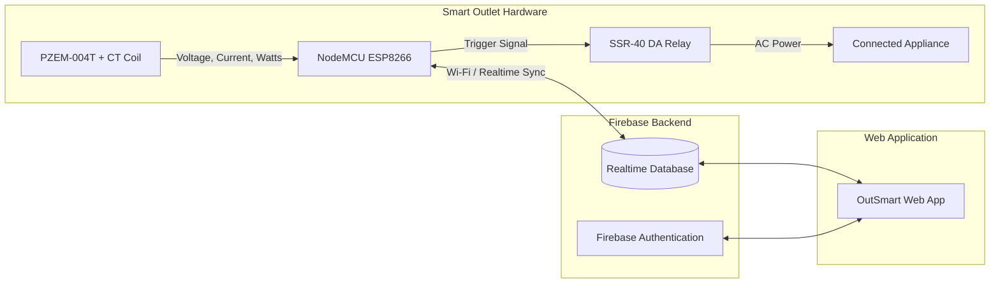

<p align="center">
  
</p>

<h1 align="center">OutSmart</h1>

<p align="center">
  <strong>A Smart Outlet Device for Monitoring and Controlling Connected Devices to Optimize Electricity Consumption</strong>
</p>

OutSmart is an IoT-enabled smart outlet device that allows users to monitor and control their
appliances in real time, reducing energy waste and enhancing safety through features like remote
control, idle device alerts, and scheduling. Designed for ease of use and compatibility with various
appliances, it simplifies energy management while promoting convenience and efficiency.

---

## User Interface

<p align="center">
  
  <br>
  <em>Figure 1: Main Dashboard with real-time telemetry stream and control panel</em>
</p>

### Interface Gallery

| Outlets Management | Bill Estimator |
| :---: | :---: |
|  |  |

| Settings & Schedules | Notification History |
| :---: | :---: |
|  |  |

| Authentication | Account Profile |
| :---: | :---: |
|  |  |

---

## System Architecture



---

## Hardware Components

The prototype smart outlet unit consists of the following components:

- **NodeMCU ESP8266 V3**: Wi-Fi enabled microcontroller that communicates with the energy sensor over UART and syncs telemetry data with Firebase in real time.
- **PZEM-004T-100A Sensor**: AC power monitoring module that measures line Voltage (V), Current (A), Active Power (W), and Power Factor.
- **CT118_2200 Current Transformer**: Split-core current coil clamped to the live AC line for non-invasive current sensing.
- **SSR-40 DA Solid State Relay**: Silent 40A DC-to-AC relay used to switch appliance power on and off safely without mechanical arcing.
- **ES03-S05 Converter**: AC-to-DC step-down power supply providing 5V DC power to the onboard electronics directly from the 220V mains.
- **AC Outlet Receptacle**: Standard wall socket interface for plugging in home or office appliances.

---

## Firmware & IoT Integration

The microcontroller firmware is located in [`outsmart_esp_32/`](outsmart_esp_32/outsmart_esp_32.ino):
- **Sensor Polling:** Reads AC line voltage, current, active power, and power factor from the PZEM-004T sensor over software serial.
- **Firebase Synchronization:** Uses `Firebase_ESP_Client` to stream real-time telemetry to the Firebase Realtime Database path (`/Outlets/outlet1`) every second.
- **Relay Actuation:** Subscribes to real-time state changes from the web application to switch the solid-state relay on GPIO 4.
- **Latency Monitoring:** Tracks round-trip read and send latency for connection diagnostics.

---

## Key Features

### Real-Time Monitoring & Quick Controls

- Live telemetry display for Voltage (V), Current (A), and Power (W).
- Individual on/off status toggles for each connected outlet.
- Global buttons to turn all connected outlets on or off simultaneously.
- Network latency indicators (read and send latency) for checking connection health.

### QR Code Device Pairing

- Add new outlets to your account by scanning the QR code on the physical device using your phone or laptop camera (integrated with `html5-qrcode`).

### Smart Idle Cutoff

- Set a custom idle wattage threshold and timeout period.
- If a connected appliance drops below the threshold (e.g., a charger left plugged in with no device, or a TV left on standby), OutSmart automatically cuts power to prevent wasted electricity.

### Timers & Recurring Schedules

- Configure countdown timers directly from the dashboard modal to turn an outlet on or off after a set duration.
- Set recurring weekly schedules for specific days and times.

### Electricity Bill Estimator

- Configure your local cost per kilowatt-hour (kWh).
- View estimated energy usage (kWh) and costs for the current billing cycle.
- Tracks peak (highest) and minimum (lowest) power draw.
- Billing cycle rollover feature to archive the current cycle and reset consumption without losing lifetime data.

### Account Management & Admin Controls

- **User Accounts**: Email/password registration, login, profile updates, and password changes.
- **Admin Panel**: System administrators can view registered users, add accounts manually, and remove accounts.
- **Notification History**: Log of past events, including manual toggles, idle cutoffs, and timer completions.

---

## Tech Stack

- **Frontend**: HTML5, Bootstrap 5, Custom CSS, JavaScript (ES6 Modules)
- **Backend / Cloud**: Firebase Realtime Database (RTDB), Firebase Authentication
- **Firmware**: Arduino C++ (`Firebase_ESP_Client`, `PZEM004Tv30`, `SoftwareSerial`)
- **External Libraries**:
  - `html5-qrcode` for QR code camera scanning
  - `bootstrap-clockpicker` for schedule and timer selection
  - FontAwesome & Ionicons for dashboard icons
- **Hosting & Deployment**: Vercel (configured with `vercel.json` for clean URLs and `.mjs` module MIME handling)

---

## Project Structure

```
outsmart/
├── index.html           # Main dashboard (live telemetry and quick toggles)
├── outlet.html          # Outlet diagnostics, renaming, and latency stats
├── billestimator.html   # Bill calculation, tariffs, and peak load tracking
├── notification.html    # Event log and system notifications
├── settings.html        # Schedule configuration and idle power rules
├── profile.html         # User profile and account details
├── help.html            # User guides and FAQ
├── login.html           # User login page
├── register.html        # User registration page
├── vercel.json          # Vercel deployment configuration
├── .gitignore           # Git ignore rules for OS and IDE files
├── OutSmart.bsdesign    # Bootstrap Studio design project file
├── outsmart_esp_32/     # Microcontroller firmware (Arduino / ESP32)
│   └── outsmart_esp_32.ino
├── context/             # Hardware schematics, user guides, and thesis documentation
└── assets/
    ├── bootstrap/       # Bootstrap CSS and JS bundles
    ├── css/             # Custom styles (clocks, toggles, responsive layout)
    ├── fonts/           # Icon and web fonts
    ├── img/             # Application icons and assets
    └── js/              # Client logic (Fire.mjs, scanner, theme)
```

---

## Running Locally

Because this project uses ES6 JavaScript modules (`.mjs`), open it through a local HTTP server rather than opening HTML files directly from the file system.

### Option 1: Using Node.js

```bash
npx serve .
```

### Option 2: Using Python

```bash
python -m http.server 3000
```

Once running, navigate to `http://localhost:3000` (or the port specified in your terminal).
